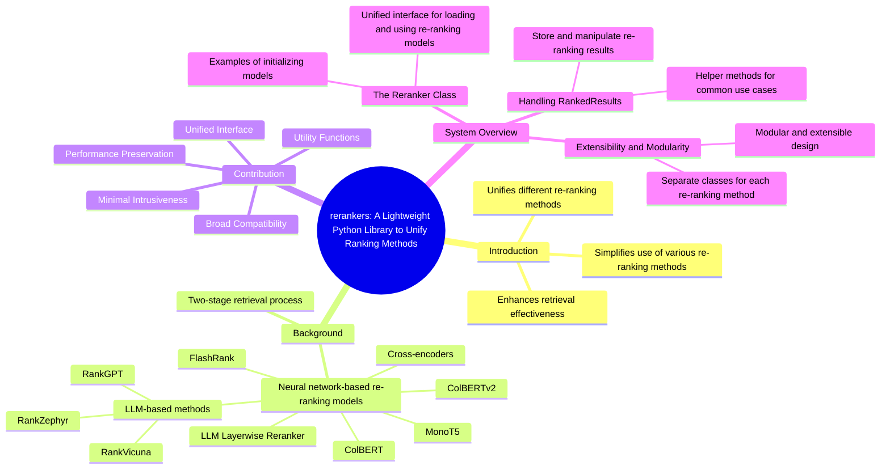

---
tags:
  - RAG
  - Rerank
  - Python
  - Package
date: 2024-09-03
---

# rerankers: A Lightweight Python Library to Unify Ranking Methods

[:simple-arxiv: Paper](https://arxiv.org/abs/2408.17344v1) [:octicons-mark-github-16: Code](https://github.com/answerdotai/rerankers)

---



## Introduction

This paper presents `rerankers`, a lightweight Python library designed to simplify the use of various re-ranking methods. Re-ranking is a crucial component of information retrieval systems, as it enhances retrieval effectiveness by reordering a set of candidate documents. The `rerankers` library unifies different re-ranking methods and provides a simple interface, making it extremely easy to switch between different re-ranking methods in the code.

## Background

Information retrieval often employs a two-stage retrieval process:

1. 🔍 A set of candidate documents is obtained using an efficient retrieval method (such as BM25 or Embedding Search)
2. 🔀 A more powerful re-ranking model reorders these documents

Over time, a variety of neural network-based re-ranking models and methods have been proposed, including:

- Cross-encoders [^BERT]
- MonoT5 [^MonoT5]
- ColBERT & ColBERTv2 [^ColBERT]
- FlashRank [^FlashRank]
- LLM-based methods:
  - RankGPT [^RankGPT]
  - RankVicuna [^RankVicuna]
  - RankZephyr [^RankZephyr]
- LLM Layerwise Reranker [^LLMLayerwise]

## Contribution

To alleviate these issues, we introduce rerankers, a simple, light-weight Python library which seeks to unify re-ranking methods. rerankers relies on three core principles:

### Unified Interface

It provides a consistent and easy-to-use interface for loading, using, and swapping between various re-ranking methods. This allows users to experiment with different approaches by changing just a single line of code.

### Minimal Intrusiveness

The library is designed to be as non-intrusive as possible, requiring minimal modifications to existing codebases or environments. This makes it easy for users to adopt and integrate rerankers into their existing workflows.

### Performance Preservation

rerankers ensures that its simplified interface does not result in any performance degradation compared to the original implementations. It achieves this by reusing original implementations whenever possible and implementing methods with the fewest dependencies necessary.

### Broad Compatibility

The library is compatible with all modern Python versions and supports a wide range of re-ranking approaches, from traditional cross-encoders to more recent LLM-based methods.

### Utility Functions

rerankers comes with utility functions to accommodate various use-cases, such as retrieving only the top-k candidates for a given query or outputting scores for knowledge distillation purposes.

## System Overview

### The Reranker Class

The core of the rerankers library is the `Reranker` class. This class serves as a unified interface for loading and using various re-ranking models, regardless of their underlying implementation or requirements. The `Reranker` class has a simple and consistent API:

```py
# Initialising a BERT-like cross-encoder model
ranker = Reranker(MODEL_NAME_OR_PATH, model_type='cross-encoder')

# MonoT5-based models, with a specified dtype
ranker = Reranker(MODEL_NAME_OR_PATH, model_type=t5, dtype=torch.float32)

# Flashrank models, with a specified device
ranker = Reranker(MODEL_NAME_OR_PATH, model_type='flashrank', device=cpu)
```

### Handling RankedResults

The `RankedResults` class is used to store and manipulate the results of re-ranking operations. It provides various helper methods to facilitate common use cases, such as retrieving the top-k results for a given query or accessing individual document scores.

```py
# Ranking a set of documents returns a RankedResults object, preserving meta-data and document-ids.
results = ranker.rank(query="I love you", docs=["I hate you", "I really like you"], doc_ids=[0,1], metadata=[{'source': 'twitter'}, {'source': 'reddit'}])
results
> RankedResults(results=[Result(document=Document(text='I really like you', doc_id=1, metadata={'source': 'twitter'}), score=-2.453125, rank=1), Result(document=Document(text='I hate you', doc_id=0, metadata={'source': 'reddit'}), score=-4.14453125, rank=2)], query='I love you', has_scores=True)

# RankedResults comes with various built-in functions for common uses, such as .top_k(), and all attributes are accessible:
results.top_k(1).text
> 'I really like you'

# It's also possible to directly fetch the score given to a single document
results.get_score_by_docid(1)
> -4.14453125
```

### Extensibility and Modularity

The rerankers library is designed to be highly modular and extensible. Each re-ranking method is implemented as a separate class, with its own set of dependencies. Users can install or uninstall these dependencies as needed, ensuring that the library remains lightweight and flexible.

[^BERT]: Devlin, J., Chang, M.W., Lee, K., Toutanova, K.: BERT: Pre-training of Deep Bidirectional Transformers for Language Understanding.
[^MonoT5]: Nogueira, R., Jiang, Z., Pradeep, R., Lin, J.: Document Ranking with a Pretrained Sequence-to-Sequence Model.
[^ColBERT]: Khattab, O., Zaharia, M.: ColBERT: Efficient and Effective Passage Search via Contextualized Late Interaction over BERT.
[^RankGPT]: Sun, W., et al.: Is ChatGPT Good at Search? Investigating Large Language Models as Re-Ranking Agents.
[^RankVicuna]: Pradeep, R., Sharifymoghaddam, S., Lin, J.: RankVicuna: Zero-Shot Listwise Document Reranking with Open-Source Large Language Models.
[^RankZephyr]: Pradeep, R., Sharifymoghaddam, S., Lin, J.: RankZephyr: Effective and Robust Zero-Shot Listwise Reranking is a Breeze!
[^ColBERTv2]: Santhanam, K., Khattab, O., Saad-Falcon, J., Potts, C., Zaharia, M.: ColBERTv2: Effective and Efficient Retrieval via Lightweight Late Interaction.
[^LLMLayerwise]: Li, C., Liu, Z., Xiao, S., Shao, Y.: Making Large Language Models a Better Foundation for Dense Retrieval.
[^FlashRank]: Damodaran, P.: FlashRank, Lightest and Fastest 2nd Stage Reranker for search pipelines.
